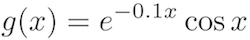
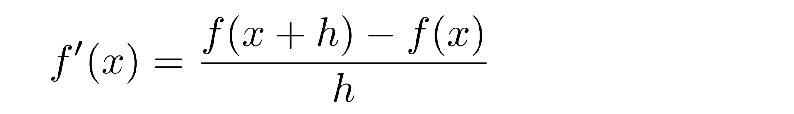
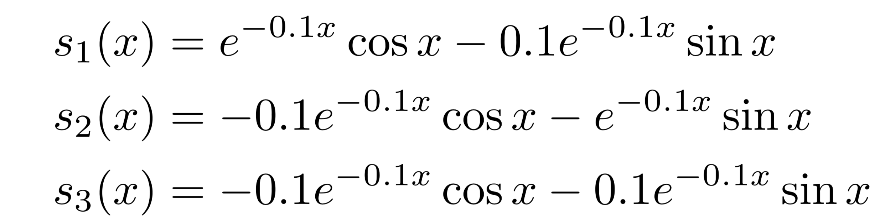

I denna uppgift kommer du att träna mer på funktioner. Du kommer även att få se hur man kan använda Python för att plotta funktioner.

Koden i denna uppgift är provkörd på [http://repl.it/languages/python3](http://repl.it/languages/python3) (Python 3).

### 1. Pröva ett befintligt paket för plottning

Det finns färdiga funktioner i Python för att plotta exempelvis funktions- eller mätvärden. Vi använder Python-paketet `matplotlib`, och en liten praktisk hjälpfunktion, som gör plottningen enklare.

Börja med att öppna ett befintligt Python-program. Det heter "plotta", och du öppnar det genom att klicka på följande länk: [https://repl.it/@patrikpersson/plotta](https://repl.it/@patrikpersson/plotta)

**Uppdrag:** Tryck på knappen **Fork**. Programmet kopieras då till ditt eget repl.it-konto.

**Uppdrag:** Kör programmet som vanligt. Bland filerna till vänster ska det nu, förutom main.py, även finnas en fil `plot.png` med en funktionsgraf. Klicka på `plot.png`. Du ska kunna se den plottade funktionen.

**Uppdrag:** Läs programmet och ta reda på vilken funktion som plottats.

### 2. Vi inför en ny funktion

Nu är vi redo att titta på en annan funktion.  Vi ska undersöka följande funktion:



**Uppdrag:** Modifiera ditt program så att du inför en funktion `g` enligt ovan. Definiera den som en (vanlig) Python-funktion. Lägg till en utskrift i ditt program, så att funktionens värde för x = 2, dvs `g(2)`, skrivs ut.

Resultatet som skrivs ut ska vara ungefär -0.34.

<details>
<summary markdown="span">
Tips
</summary>
<p>
<pre>
def g(x):
  # ... 
...
print(g(2))
</pre>
</p>
</details>

### 3. Plotta funktionen

Att skriva ut ett enda funktionsvärde, som ovan, säger oss inte speciellt mycket om hur funktionen ser ut. Vi vill istället plotta funktionen för x-värden från 0 till 10. 

**Uppdrag:** Modifiera ditt program så att funktionen `g(x)` plottas för x-värden i intervallet 0 <= x < 10. 

**Uppdrag:** Du finner, som tidigare, din graf i filen `plot.png`.

### 4. Derivera numeriskt

Vi intresserar oss nu för funktionens derivata, g'(x). Det är fullt möjligt att derivera funktionen symboliskt (med hjälp av deriveringsreglerna). Här ska vi emellertid plotta g'(x) på ett annat sätt, nämligen genom att låta datorn **beräkna** derivatans värde för varje x-värde.

För detta använder vi derivatans definition:



Ofta ser man detta samband som ett gränsvärde, där man tänker sig h gå mot 0 (noll). Här ska vi istället använda sambandet som utgångspunkt för att beräkna derivatan av en funktion `f` för x-värdet `x`. 

**Uppdrag:** Inför en Python-funktion `deriv` i ditt program. Dess resultat är funktionen `g`:s derivata för värdet `x`. Använd derivatans definition (ovan) för beräkningen. 

Din Python-kod kan se ut i stil med följande:

```python
h = 0.00001

def deriv(x):
  # ... fyll i derivataberäkning här 
```

**Uppdrag:** Ändra ditt program så att `g` och `deriv` plottas i samma bild.

<details>
<summary markdown="span">
Tips
</summary>
<p>
Du behöver två anrop till <code>fplot</code>: ett för <code>g</code> och ett för <code>deriv</code>. 
</p>
</details>

Den första funktionen ritas i blått, den andra i orange.

**Uppdrag:** Är derivatan rimlig?

<details>
<summary markdown="span">
Tips
</summary>
<p>
När <code>g</code> har ett lokalt minimum ska derivatan vara noll.
När <code>g</code> pekar som brantast uppåt ska derivatan ha ett lokalt maximum.
</p>
</details>

### 5. Testa några möjliga derivator

Som vi redan nämnt kan man även derivera `g` symboliskt, det vill säga med hjälp av deriveringsreglerna.

De tre vännerna Bent, Alva och Kit har försökt göra detta, men det är länge sedan de gick i gymnasiet, och endast ett vagt minne av deriveringsreglerna återstår. De kommer fram till olika svar:



**Uppdrag:** Använd Python för att ta reda på vilken av derivatorna s1, s2 och s3 som bäst stämmer överens med den beräknade (`deriv`). Vem av de tre kan sina deriveringsregler bäst?

Du ska alltså **inte** använda dina egna kunskaper om deriveringsreglerna i denna uppgift.

<details>
<summary markdown="span">
Tips
</summary>
<p>
Du kan exempelvis införa en funktion som följer:
<pre>
def diff1(x):
  return deriv(x) - s1(x)
</pre>
Plotta funktionen.
Den visar hur mycket <code>deriv</code> och <code>s1</code> skiljer sig åt. Om de är helt lika blir skillnaden 0, och då ska grafen för <code>diff1</code> ju bli en horisontell, rät linje.
</p>
</details>

