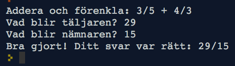

I denna uppgift programmerar vi ett spel där datorn kan hjälpa oss att förenkla och summera heltalsbråk, och kontrollera att vi räknar rätt.

Innan du gör uppgiften kan det vara bra att ha gjort uppgiften [Piece of cake](../piece-of-cake/README.md) som också handlar om bråktal.

A. Förenkla bråk
----------------

### A.1 Förenkla ett bråk
Om vi har ett heltalsbråk, t.ex.

     24
    –––––
     210

så kan vi förenkla det om vi kan dela både nämnare och täljare med samma tal. Här kan vi t.ex. dela både 24 och 210 med 2, så då får vi:

     24        12
    –––––  =  –––––
     210       105

Och vi ser att vi kan fortsätta att förenkla bråket eftersom både 12 och 105 är delbara med 3, så vi får:

     24        12        4
    –––––  =  –––––  =  ––––
     210       105       35

och nu kan vi inte förenkla mer. Varför?

<details>
  <summary markdown="span">
    Svar
  </summary>
  <p>
  Eftersom det inte finns något heltal som både 4 och 35 är jämnt delbara med. Detta kan vi visa genom att primtalsfaktorisera 4 och 35 till 2*2 respektive 5*7. Hade det funnits något tal de var jämnt delbara med så hade det dykt upp som en faktor hos båda faktoriseringarna.
  </p>
</details>

----

### A.2 Förenkla med hjälp av gcd
Ett enkelt sätt att förenkla ett bråk är att först hitta det *största* heltalet som både täljare och nämnare går att dela med, och sedan helt enkelt dela både täljare och nämnare med detta tal. Då får vi ett bråk som inte kan förenklas mer.

Det största talet som två tal kan delas jämnt med kallas deras *största gemensamma delare*. På engelska heter det *greatest common divisor*, förkortat **gcd**. Om vi har två tal a och b kan vi skriva deras gcd som ett funktionsanrop: `gcd(a,b)`.

Vad är `gcd(24, 210)`?

<details>
  <summary markdown="span">
    Svar
  </summary>
  <p>
  Vi såg ovan att vi kunde förenkla 24/210 till sin enklaste form genom att dela båda talen med 2 och därefter med 3. gcd(24, 210) är alltså 2*3, dvs 6.
  </p>
</details>

----

### A.3 Programmera gcd

Det finns många sätt (algoritmer) för att räkna ut gcd. Nedan visas Python-kod för att räkna ut gcd med Euclides algoritm, beskriven i hans bok Elementa (cirka 300 f.Kr.).
Algoritmen går ut på att ta det största talet och ändra det genom att subtrahera det mindre talet. Genom att göra detta gång på gång tills talen är lika så får man gcd:

```python
def gcd(a, b):  # Räkna ut gcd för a och b
  while a != b: # Så länge talen inte är lika:
    if a > b:     # Om a är större än b
      a = a - b   # Ändra på a genom att subtrahera b
    else:         # Annars (dvs b är större än a)
      b = b - a   # Ändra på b genom att subtrahera a
                # Nu är while-loopen färdig
                # dvs a och b är lika
  return a      # Returnera gcd, dvs nuvarande värdet på a
```

**Uppdrag:** Klistra in koden för gcd-funktionen ovan. Prova vad resultatet blir för några exempel, t.ex.

```python
print(gcd(24, 210))
print(gcd(2,4))
print(gcd(12,24))
print(gcd(24, 60))
print(gcd(5,5))
print(gcd(2,5))
```

Försök gissa vilket svaret skall bli innan du kör exemplen. Vilka svar får du?
<details>
  <summary markdown="span">
    Svar
  </summary>
  <p>
  Du borde få följande svar: 6, 2, 12, 12, 5, 1. Prova med några exempel till och övertyga dig om att de stämmer.
  </p>
</details>

---

### A.4 Programmera förenkling av bråk

Nu när vi har gcd-funktionen är det enkelt att programmera en funktion `simplify` som förenklar ett bråk. Funktionen behöver bara dela både täljare och nämnare med deras största gemensamma delare.

**Uppdrag:** Skriv en funktion `simplify(t,n)` som tar en täljare och nämnare som input och som returnerar en ny täljare och nämnare, motsvarande det förenklade bråket.

Till exempel skall anropet `simplify(24, 210)` returnera täljaren 4 och nämnaren 35.

**Programmeringstips 1:** För att returnera två resultat från funktionen skriver du dem inom parentes. Till exempel:
```python
def simplify(...):
  r1 = ...
  r2 = ...
  return (r1, r2)
```
Och för att fånga upp båda returvärdena efter ett anrop av funktionen kan man tilldela två variabler på följande sätt:

```python
(v1, v2) = simplify(...)
```

**Programmeringstips 2** I denna uppgift skall du använda heltalsdivision vilket skrivs `//` i Python. Du får då ett heltal tillbaka. T.ex. ger `4//2` resultatet `2`. Om du i stället skriver `4/2` får du i Python 3 resultatet `2.0`, vilket är ett *flyttal* (*float* på engelska).

Prova din funktion `simplify` på olika bråk och kontrollera att den räknar rätt. Du kan till exempel skriva:

```python
(a, b) = simplify(24, 210)
print(a)
print(b)
```

### A.5 Enkelt bråkspel

Nu skall vi programmera ett spel där spelaren får svara på hur ett bråk kan förenklas. Programmet skall hitta på olika bråk och kontrollera att spelaren räknat rätt.

Vi börjar med en mycket enkel prototyp för spelet, som hela tiden hittar på samma bråk, och som inte ännu kontrollerar om spelaren svarat rätt:

```python
def inventFraction():   # Hitta på ett bråk
  return(4,6)

def strFraction(a,b):   # Gör om bråket från tal till sträng
  return str(a) + "/" + str(b)

def game():             # Spelet
  (a,b) = inventFraction()
  print("Förenkla " + strFraction(a,b))
  pa = int(input("Vad blir täljaren?"))
  pb = int(input("Vad blir nämnaren?"))
  print("Du svarade: " + strFraction(pa,pb))
  print("Jag vet inte om det är rätt.")

game()                 # Kör spelet
```

**Uppdrag:** Klistra in koden och provkör spelet. Förbättra funktionen `game` så att den kontrollerar om spelaren svarat rätt eller inte, och skriver ut t.ex. "Rätt svarat" respektive "Tyvärr, det var fel. Svaret är ...". *Tips!* Använd din funktion `simplify` för att räkna ut det rätta svaret. Använd en `if`-sats för att kontrollera om spelaren svarat rätt.

**Programmeringstips:** För att testa om två bråk är lika kan du skriva ett uttryck i följande stil: `(pa==ca) & (pb==cb)`. Operatorn `==` testar likhet och operatorn `&` betyder "och". Uttrycket betyder alltså att "pa är lika med ca och pb är lika med cb". Parenteserna är viktiga att ha med i detta fall, för annars tolkas uttrycket på ett annat sätt i Python.

### A.6 Intressant Bråkspel

För att spelet skall bli intressant behöver vi ändra funktionen `inventFraction` så att den hittar på ett nytt bråk varje gång. Detta kan vi göra med standard-funktionen `random` som drar ett slumptal:

```python
from random import randint
r = randint(5,10)   # Returns a random int between 5 and 10
```

**Uppdrag:** Ändra funktionen `inventFraction` så att den returnerar ett slumpmässigt bråk. Hur skall du konstruera ett bråk så det blir intressant att förenkla? Prova ditt spel. Kan du svara rätt? Blir det lagom svårt?


<details>
  <summary markdown="span">
    Tips!
  </summary>
  <p>
  För att bråken skall bli intressanta att förenkla krävs det att täljare och nämnare har gemensamma delare. Det kan du åstadkomma genom att dra ett extra slumptal som du multiplicerar både täljare och nämnare med. Prova med att dra slumptal ur olika intervall för att få spelet lagom lätt eller svårt.
  </p>
</details>

---

B. Summera bråk
---------------

Kan du räkna ut följande summa?

     2     1       ?
    ––– + –––  =  –––
     3     6       ?

<details>
  <summary markdown="span">
    Tips!
  </summary>
  <p>
  För att kunna summera två saker behöver de vara av samma *slag*. I detta fall kan vi göra om tredjedelarna till sjättedelar, dvs två tredjedelar är detsamma som fyra sjättedelar. Vi ser då att summan är 4 sjättedelar plus 1 sjättedel, dvs 5/6.
  </p>
</details>

----

Hur kan vi räkna ut en summa av två bråk i det generella fallet? Dvs vad skall resultatet bli om vi inför variablerna
 `a`, `b`, `c`, `d` för de två bråken?

       a     c          ?
      ––– + –––   =   –––––
       b     d          ?

Nedan följer en kort teoridel om hur detta går till. Vet du redan hur man gör, så hoppa direkt ner till [B1](B.1-Programmera-summering-av-två-bråk).

### Teoridel

För att få samma nämnare på bråken kan vi multiplicera det vänstra bråket med `d/d` och det högra med `b/b`:

     a     c         a     d       b     c
    ––– + –––   =   ––– . –––  +  ––– . –––
     b     d         b     d       b     d

Eller förenklat:

       ad     bc
    = –––– + ––––
       bd     bd


Både `d/d` och `b/b` är ju lika med 1, så vi har inte ändrat bråkens värde. Vi ser nu att bråken har samma nämnare och kan då lägga ihop täljarna:

       ad + bc
    = –––––––––
         bd

Eller med programmeringssyntax:

     a     c       a*d + b*c
    ––– + –––  =   –––––––––
     b     d          b*d

Om vi provar på exemplet vi hade i början får vi:

     2     1       2*6 + 3*1       12+3       15       5
    ––– + –––  =  ––––––––––   =   ––––   =  ––––  =  –––
     3     6          3*6           18        18       6

(I sista steget förenklade vi bråket genom att dividera täljare och nämnare med 3.)

### B.1 Programmera summering av två bråk

Utgå från programmet du gjorde i uppgift A. (Spara gärna en kopia först.)

**Uppdrag:** Skriv en funktion `sumFractions(a, b, c, d)` som räknar ut summan av `a/b` och `c/d`. Resultatet skall förenklas och returneras som en täljare och en nämnare.

Prova att anropa `sumFractions` för några exempel och att skriva ut resultatet. T.ex. för att summera 2/3 + 1/6:

```python
(t, n) = sumFractions(2, 3, 1, 3)
print(strFraction(t,n))
```

Här är några exempel du kan testa, så du ser att resultatet blir rätt:

* 2/3 + 1/6 = 5/6
* 1/3 + 1/6 = 1/2
* 1/4 + 2/3 = 11/12

### B.2 Spel som summerar två bråk

**Uppdrag:**
Ändra spelet så att det hittar på två bråk och frågar spelaren om vad summan är. Ändra funktionen `inventFraction` så att spelet blir lagom svårt.

C: Extra. Utöka spelet
----------------------

**Uppdrag:**
Fundera ut något sätt att utöka spelet. Några ideer:

* Låt spelaren omväxlande addera och subtrahera bråk
* Gör om frågan till ett "lästal" i stil med att "Stina äter 2/7 tårta och Lasse äter 1/4. Hur stor del tårta har de ätit sammanlagt?"
* Låt spelet köra i en loop och räkna ut hur snabb eller bra spelaren är. T.ex. bästa tid, genomsnittstid, längsta rätt lösta sekvens, etc.
* ...
