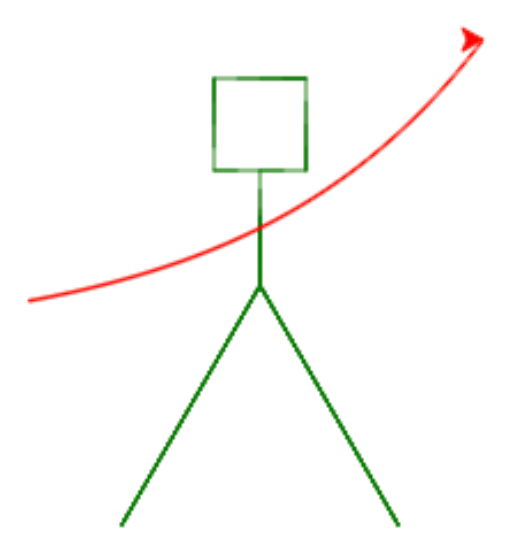

I denna uppgift kommer du att träna på funktioner.

Koden i denna uppgift är provkörd på [http://repl.it/languages/python-turtle](http://repl.it/languages/python-turtle) (Python 2.7).

### 1. Rita en streckgubbe

Inför fortsättningen behöver vi programkod som ritar en streckgubbe utan armar. (Gubben kommer att få armar senare.)

Till att börja med behöver vi ett tomt program, som importerar `turtle`- och `math`-paketen och skapar en Turtle. Vi behöver även återanvända funktionen `jumpTo` från en tidigare uppgift. Vi kommer att ha nytta av den senare.

```python
import turtle
import math

t = turtle.Turtle()

def jumpTo(x, y):
  t.penup()
  t.setpos(x,y)
  t.pendown()
```

Lägg nu till rader i programmet som ritar gubbens ben, kropp och huvud.

*Tips:* Använd funktionerna `t.right(...)`, `t.forward(...)`, och `t.left(...)`.

Kom ihåg att lösa uppgiften i delar. Börja exempelvis med ett av benen, och se till att det blir rätt. När det stämmer utökar du ditt program med ett ben till. På samma sätt fortsätter du med ett streck för kroppen. Om du hellre vill börja med huvudet går det naturligtvis också bra.

<details>
<summary markdown="span">
Möjlig lösning
</summary>
<p>
Följande Python-program ritar en enkel streckgubbe med fyrkantigt huvud.

<pre>
import turtle

t = turtle.Turtle()

t.setheading(225)
t.forward(100)
t.left(180)
t.forward(100)
t.right(90)
t.forward(100)
t.left(180)
t.forward(100)
t.right(45)
t.forward(200)
t.right(90)
t.forward(50)
t.left(90)
for sida in range(3):
  t.forward(100)
  t.left(90)
t.forward(50)
</pre>
</p>
</details>

**Uppdrag:** Provkör programmet! Kontrollera att streckgubben (utan armar) ser rimlig ut.

### 2. Vi inför en funktion

Nu ska vi införa en funktion för att rita streckgubben. Denna funktion ska innehålla Python-satserna du skrev i föregående uppgift. Funktionen kan exempelvis heta `gubbe`:

```python
import turtle
import math

t = turtle.Turtle()

def jumpTo(x, y):
  # ... enligt tidigare

def gubbe():
  # ... satserna för att rita gubben, enligt tidigare uppgift
```

Inför funktionen `gubbe` enligt ovan och använd dina Python-satser där.

Kom ihåg att satserna i funktionen måste vara indenterade (indragna) med ett par mellanslag, annars kommer inte Python-tolken att förstå att de har med `gubbe` att göra.

**Uppdrag:** Kör programmet. Varför ser du inte längre någon gubbe?

Lägg nu till en rad i ditt program som anropar funktionen gubbe.

<details>
<summary markdown="span">
Tips
</summary>
<p>
Jämför med vimpel-exemplet i uppgiften Sköldpaddsgrafik om du är osäker.
</p>
</details>

**Uppdrag:** Kör programmet igen. Nu när anropet till funktionen `gubbe` är på plats ska gubben vara tillbaka, fortfarande utan armar.

### 3. Flytta gubben så att halsen kommer i origo
Lite senare kommer vi att rita armarna med hjälp av en matematisk funktion. Därför vill vi först flytta gubben så att dess hals hamnar i origo.

**Uppdrag:** Lägg till ett anrop till `jumpTo` i början av gubbe-funktionen så att gubbens hals hamnar i origo. Prova olika parametrar till `jumpTo` så du ser vilka koordinater som är lämpliga.

*Tips:* För att se var origo är kan du lägga till anropet `jumpTo(0,0)` *efter* anropet till gubben.

### 4. Vi inför en funktion till, för armarna

Vi kommer att pröva ett par olika sätt att rita gubbens armar. Först vill vi rita armarna som ett helt vanligt vågrätt streck.

**Uppdrag:** Lägg till en funktion `armar` som ritar armarna genom att dra ett streck från positionen `(-100, 0)` till `(100, 0)`.

*Tips!* Använd `jumpTo` för att hoppa till (-100,0), `t.setheading(0)` för att sätta riktningen till 0 grader, dvs rakt åt höger, och sedan `t.forward(...)` för att rita strecket.


Provkör programmet. Vad händer?

<details>
<summary markdown="span">
Tips
</summary>
<p>
Kom ihåg att funktionen <code>armar</code> måste anropas, precis som <code>gubbe</code>.
</p>
</details>

Om du tycker att armarna hamnar för högt eller för lågt, så justera positionen på gubben igen så det ser bra ut.

### 5. Vi prövar en matematisk funktion

Nu lägger vi streckgubben åt sidan en stund. Vi återkommer snart till den.

Istället ska vi införa en funktion till. Denna gång är det en funktion som, liksom matematiska funktioner, ger ett värde som resultat.

Vi börjar med den enkla funktionen


En sådan funktion skrivs i Python så här:

```python
def f(x):
  return -x
```

(Nyckelordet `return` talar om vilket värde funktionen skall returnera. De andra funktionerna vi skrivit tidigare har bara utfört kommandon, och inte räknat ut något resultat.)

Lägg till funktionen ovan i ditt program. Liksom tidigare händer det inget förrän funktionen anropas.

Vi ska snart använda funktionen till streckgubben, men först vill vi pröva den och se att den fungerar som vi förväntar oss.

Lägg därför till följande rader i ditt program (exempelvis sist):

```python
print f(1), f(3), f(-5)
```

**Uppdrag:** kör programmet, inklusive raderna ovan. Klicka på fliken _Console_, där utskrifterna (`print`) hamnar. Stämmer de tre värdena för f(x)?

### 6. Vi ger gubben matematiska armar

Nu ska vi förändra funktionen `armar`, så att gubbens armar ritas genom att vi plottar funktionen `f`. För detta behöver vi återigen införa en hjälpfunktion. Funktionen `plot` nedan använder sköldpaddan för att placera en punkt på koordinaterna `(x,y)`:

```python
def plot(x, y):
  jumpTo(x, y)
  t.dot(1)
```

**Uppdrag:** Lägg till funktionen `plot` till ditt program. Ändra sedan funktionen `armar` så att den plottar funktionen `f` från 0 till 100, i stället för att rita ett streck.

*Tips:* För att plotta funktionen kan du använda en `for`-loop med en loop-variabel `i`:
```python
for i in range(100):
  plot(...)
```

Variabeln `i` får då värdena 0, 1, 2, 3, ... (ett värde för varje varv i loopen). Vilka skall parametrarna vara till `plot`?

<details>
<summary markdown="span">
Lösning:
</summary>
<pre>
def armar():
  for i in range(100):
    plot(i, f(i))
</pre>
</details>

**Uppdrag:** Kör programmet. Hur många armar har streckgubben? Kan du se hur armen motsvarar funktionen `f(x)`?

<details>
<summary markdown="span">
Tips: om du tycker det går för långsamt
</summary>
<p>
Det är många punkter som ska plottas. Man kan snabba upp Turtle-grafiken genom att bara uppdatera fönstret (exempelvis) var 10:e gång. Stoppa in följande rad i ditt program, direkt efter raden <code>t = turtle.Turtle()</code>:

<pre>
t.getscreen().tracer(10)
</pre>
</p>
</details>

Vi behöver tydligen ändra i programmet för att få med båda armarna. Just nu antar `i` ovan bara positiva värden.

**Uppdrag:** Ändra din `for`-sats så att `i` antar värden från -100 till 100. Använd `range(-100, 100)`.

Nu ska gubben ha två armar, en som pekar uppåt, och en som pekar neråt. Kan du se att det är funktionen `f(x)` enligt ovan som avbildas?

### 7. Vi prövar andra funktioner

Vi skall nu prova att plotta lite fler funktioner genom att ändra på definitionen av `f(x)`.

**Uppdrag:** använd din streckgubbe för att plotta följande funktioner, en i taget.


*Tips:*
I Python skrivs sin(x) som `math.sin(x)` och pi som `math.pi`. Detta förutsätter att man i början av programmet skrivit `import math`, som vi gjort.

*Tips:* Glöm inte att man måste använda nyckelordet `return` i Python-funktionen för att den skall returnera ett värde till anropet.

**Uppdrag:** Hitta på en egen funktion som du plottar som armar.

*Tips:* För att armarna skall hamna förnuftigt, så se till att funktionen är noll eller nära noll för x=0. Du kan göra `print(f(0))` för att se vad funktionens värde är vid x=0.

*Tips:* Du kan också behöva skala funktionen så att värdena inte blir alldeles för stora (eller för små) vid slutet av armarna. Prova t.ex. med `print(f(100))` för att se funktionens värde vid x=100. Prova att ändra funktionen genom att multiplicera eller dividera med 100 eller någon annan konstant för att få lagom stora värden.

### 8. Funktion som parameter (avancerat)

Uppgiften ovan löste du genom att ändra i din funktion `f`. Det vore praktiskt om man istället kunde ha många olika funktioner definierade, och därefter bara peka ut den önskade funktionen i anropet till `armar`.

Vi vill alltså ha en funktion `armar` som har en parameter. Parametern syftar i sin tur på den funktion som ska plottas. Om vår `armar`-funktion fungerar så, så kan den användas så här:

```python
def g(x):
  return x / 2.0

def h(x):
  return 50 * math.exp(x / 100.0) - 50

gubbe()
armar(g)    # plotta funktionen g
```

Här definieras ett par bra funktioner `g` och `h`, och därefter används `armar` för att plotta en av dem.

**Uppdrag:** ändra din funktion `armar` så att man kan använda en parameter enligt ovan.

<details>
<summary markdown="span">
Tips
</summary>
<p>
I <code>armar</code> används namnet <code>f</code> för att bestämma vilken funktion som ska plottas. Låt <code>f</code> vara en parameter till <code>armar</code>, på samma sätt som <code>x</code> och <code>y</code> är parametrar till <code>jumpTo</code>.
</p>
</details>

Genom att ändra `g` till `h` ovan kan man nu enkelt välja vilken funktion som ska plottas.

*Kommentar 1:* Vid divisionerna i `g` och `h` används reella tal som `2.0` och `100.0` i stället för heltal `2` och `100`. Det är för att Python 2.7 (som används för paddan) tolkar division mellan två heltal som heltalsdivision där resten försvinner. När t.ex. Python räknar ut 3/2 blir resultatet 1 (i stället för 1.5). Men när något av talen i divisionen är ett reellt tal, så blir resultatet också reellt. Så när Python räknar ut 3/2.0 blir resultatet 1.5, som vi förväntar oss.

*Kommentar 2:* Skall man vara riktigt noga så ger `range(-100,100)` värdena -100, -99, -98, ... 97, 98, 99. Dvs för att plotta funktionen från -100 till 100 borde vi egentligen skriva `range(-100, 101)`.
