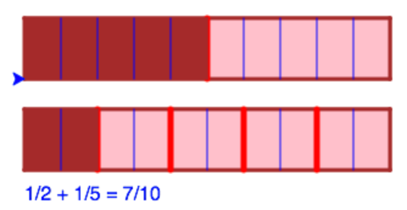
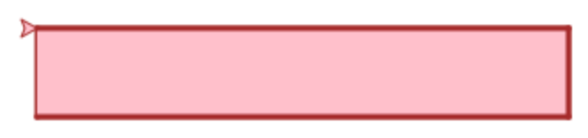
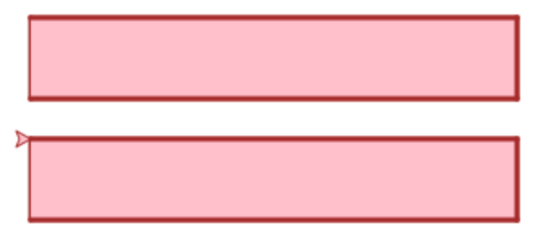
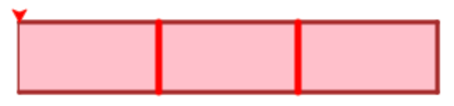
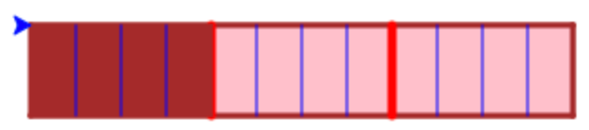
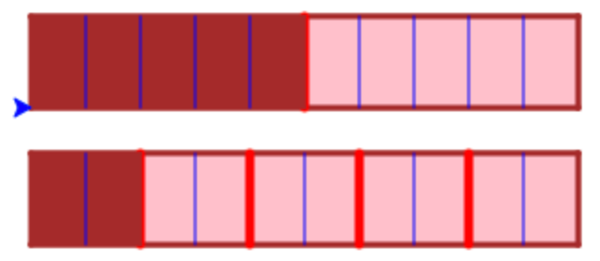
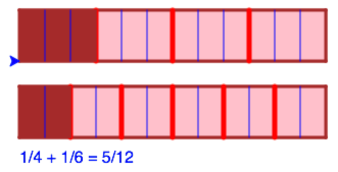

Denna uppgift går ut på att illustrera heltalsbråk som delar av tårtor.

Innan du gör uppgiften bör du ha lite koll på "turtle graphics", t.ex. genom att göra uppgiften [Turtle](../turtle/README.md).



Koden i denna uppgift är provkörd på [http://repl.it/languages/python-turtle](http://repl.it/languages/python-turtle) (Python 2.7).

Koden i denna uppgift är provkörd på [http://kojojs.kogics.net](http://kojojs.kogics.net) (Scala).


A: Tredjedelar och fjärdedelar
------------------------------

### A.1 Rita en tårta

Rita en avlång rektangulär tårta med "turtle graphics". Kanten på tårtan skall vara i en färg och den skall vara fylld med en annan färg. T.ex.:




Till din hjälp, deklarera en turtle som du kallar `t`:

```python
import turtle
t = turtle.Turtle()
```


Klistra in följande funktioner i ditt script för att kunna hoppa till en given plats och för kunna att rita en fylld rektangel:



```python
# Jump to a position without drawing anything
def jumpTo(x,y):
  t.penup()
  t.setx(x)
  t.sety(y)
  t.pendown()
```
```python
# Draw a filled rectangle
def drawRect(width, height):
  t.begin_fill()
  t.forward(width)
  t.right(90)
  t.forward(height)
  t.right(90)
  t.forward(width)
  t.right(90)
  t.forward(height)
  t.right(90)
  t.end_fill()
```

```scala
// Jump to a position without drawing anything
def jumpTo(x: Int, y: Int) = {
  setPosition(x,y);
}
```
```scala
// Draw a rectangle
def drawRect(width:Int, height:Int) = {
  forward(width)
  right(90)
  forward(height)
  right(90)
  forward(width)
  right(90)
  forward(height)
  right(90)
}
```


Tips: Så här kan du sätta pennbredden, pennfärgen, och fyllningsfärgen:



```python
  t.width(3)            # Sätt bredden på pennan
  t.color('green')      # Sätt färgen på pennan
  t.fillcolor('red')    # Sätt fyllningsfärgen
```

```scala
  setPenThickness(3)    // Sätt bredden på pennan
  setPenColor(green)    // Sätt färgen på pennan
  setFillColor(red)     // Sätt fyllningsfärgen
```


Och så här kan du sätta riktningen på sköldpaddan:



```python
  t.setheading(0) # Sätt riktningen till 0 grader (dvs mot öster)
```

```scala
  setHeading(0)  // Sätt riktningen till 0 grader (dvs mot öster)
```


**Uppdrag:** Rita tårtan!

Prova med olika färger, t.ex. `blue`, `violet`, `pink`, `gold`, `orange`, `brown`, `red`, `green`, `white`, `black`.  [Här](https://www.tcl.tk/man/tcl8.4/TkCmd/colors.htm) finns en lista på fler färger som kan användas. 

Prova att placera tårtan på olika ställen genom att anropa `jumpTo` innan du anropar `drawRect`

### A.2 Rita två tårtor

**Uppdrag:** Rita två tårtor snyggt placerade bredvid varann. Tårtorna skall vara lika stora. T.ex. så här:




### A.3 Extra: snygga till tårtorna

**Uppdrag:** Om du tycker om snygga tårtor, skriv kod som dekorerar dem. Kanske med en ros i mitten på varje tårta?

### A.4 Skär upp tårtorna

Nu ska vi skära upp tårtorna.

Till din hjälp, klistra in följande kod i ditt script.



```python
# Hop forward without drawing
def hop(x):
  t.penup()
  t.forward(x)
  t.pendown()

# Slice a rectangle in a number of pieces
def sliceRect(width, height, pieces):
  pieceWidth = float(width)/pieces
  for i in range(pieces-1):
    hop(pieceWidth)
    t.right(90)
    t.forward(height)
    hop(-height)
    t.left(90)
  hop(-pieceWidth*(pieces-1)) # Go back to original pos
```

```scala
// Helper function for coding repetition
def repeat(n: Int)(f: => Unit) {
  if (n > 0) {
    f
    repeat(n-1)(f)
  }
}

// Slice a rectangle in a number of pieces
def sliceRect(width:Double, height:Double, pieces:Int) = {
  val pieceWidth = width/pieces
  repeat (pieces-1) {
    hop(pieceWidth)
    right(90)
    forward(height)
    hop(-height)
    left(90)
  }
  hop(-(pieceWidth)*(pieces-1)) // hop back to initial position
}
```


Funktionen `sliceRect` skär upp en rektangel i ett antal lika stora bitar genom att rita streck över rektangeln.

**Uppdrag:** Skär upp översta tårtan i tredjedelar och nedersta tårtan i fjärdedelar. Använd en annan färg till snitten än du hade tidigare. Den tredelade tårtan borde se ut ungefär så här:



*Obs!* Du måste hoppa till rätt ställe innan du anropar `sliceRect`, och du måste anropa den med samma bredd och höjd som du ritade rektanglarna med tidigare.

*Tips:* Går det långsamt att rita? Du kan ställa in hastigheten på paddan så här:



```python
t.speed(0)   # Rita så fort som möjligt
```

```scala
setAnimationDelay(0)  // Rita så fort som möjligt
```


### A.5 Lägg till konstanter
Du använder nu troligen samma värden för position, bredd och höjd på flera ställen i ditt program. Då blir koden svårläst. Det blir också jobbigt att t.ex. flytta en tårta eftersom du måste ändra värdena på flera ställen i ditt program.

Det vore enklare om du hade namn på dessa värden, t.ex. `cake1pos`, `cake2pos`, `cakewidth`, `cakeheight`, så slipper du skriva numeriska värden på många ställen i programmet.

Börja med att lägga till en funktion som gör det möjligt att hoppa till en position som är sparad som ett par av koordinater:



```python
# Jump to a position given as a pair of coordinates
def jumpToPos(pos):
  (x,y) = pos
  jumpTo(x,y)
```

```scala
// Jump to a position given as a pair of coordinates
def jumpToPos(pos:(Int, Int)) = {
  val (x,y) = pos
  setPosition(x,y)
}
```


Inför sedan konstanter för dina värden, t.ex.



```python
cake1pos = (-50, 100)
cake2pos = (-50, 25)
cakewidth = 300
cakeheight = 50
```

```scala
val cake1pos = (-50, 75)
val cake2pos = (-50, 0)
val cakewidth = 300
val cakeheight = 50
```


**Uppdrag:** Inför konstanter för tårtpositioner och bredd och höjd på tårtorna. Ändra dina anrop så de använder konstanterna i stället för numeriska värden. Prova att ändra konstanterna och kontrollera att ditt program fortfarande fungerar.

### A.6 Ät tårta

Nu skall vi illustrera att du äter en bit av den ena tårtan och en bit av den andra.

**Uppdrag:** Färga tårtbiten längst till vänster på vardera tårtan. Resultatet borde bli ungefär så här för den tredelade tårtan:


*Tips*: Anropa `drawRect` med en tredjedel av bredden för den första tårtan och en fjärdedel av bredden för den andra tårtan. Till exempel så här:

```python
drawRect(cakewidth/3, cakeheight)
```

### A.7 Hur mycket har du ätit?

Nu har du ju ätit 1/3 tårta plus 1/4 tårta. Hur mycket tårta blir det sammanlagt?

Om vi hade delat varje tårta i tolftedelar (delbart med både 3 och 4), så hade vi lätt kunnat se hur mycket tårta det blir.

Nu skall vi illustrera detta. Till din hjälp, klistra in följande funktion:



```python
# Slice each piece into a number of slices
def slicePieces(width, height, pieces, slices):
  pieceWidth = float(width)/pieces
  for p in range(pieces):
    sliceRect(pieceWidth, height, slices)
    hop(pieceWidth)
  hop(-(pieceWidth)*(pieces)) # Go back to original pos
```

```scala
// Slice each piece into a number of slices
def slicePieces(width:Double, height:Double, pieces:Int, slices:Int) = {
  val pieceWidth = width/pieces
  repeat (pieces) {
    sliceRect(pieceWidth, height, slices)
    hop(pieceWidth)
  }
  hop(-(pieceWidth)*(pieces))
}
```


Denna funktion skär upp en tårta som redan är delad i `pieces` bitar, så att varje bit delas ytterligare i `slices` delar.

**Uppdrag:** Skär upp de båda tårtorna i tolftedelar.

*Tips:* Anropa `slicePieces` så du skär upp bitarna i den tredelade tårtan i fjärdedelar och bitarna i den fyra-delade tårtan i tredjedelar. Den tredelade tårtan borde nu se ut så här:



**Quiz:** Hur många tolftedelar tårta är uppätna totalt?

<details>
  <summary markdown="span">
    Svar
  </summary>
  <p>
  7
  </p>
</details>

----

B: Godtyckliga tårtbitar
------------------------

### B.1 Generalisera programmet

Ditt program illustrerar hur

     1     1       7
    ––– + –––  =  ––––
     3     4       12

Vi skall nu generalisera programmet så att du kan prova med andra bråk.

*Tips:* Spara en kopia av ditt fungerande program innan du börjar ändra något.

**Uppdrag:** Kapsla in koden för att rita, dela, äta, och skära tårtorna i en ny funktion `showFractionAdd(n,m)` så att du kan anropa den för att illustrera ekvationen:

     1     1       n+m
    ––– + –––  =  ––––-
     n     m       n*m

Om du t.ex. anropar `showFractionAdd(2,5)` så skall du få följande resultat:



*Tips:* Börja med att lägga in din kod i den nya funktionen, och kolla att den fungerar när du anropar den med `showFractionAdd(3,4)`. Generalisera sedan funktionen så att den använder parametrarna `n` och `m` i stället för `3` och `4`.

### B.2 Skriv ut ekvationen

**Uppdrag:** Utöka koden i `showFractionAdd` så att den skriver ut ekvationen under tårtorna. När du nu anropar `showFractionAdd(2,5)` så skall du få följande resultat:


*Tips:* Här är lite kod du kan använda för att skriva ut ekvationen:



```python
s1 = "1/"+str(n)
s2 = "1/"+str(m)
s3 = str(n+m)+"/"+str(n*m)
s4 = s1 + " + " + s2 + " = " + s3
t.write(s4, font=("Arial", 12, "normal"))
```

```scala
val s1 = "1/"+n.toString
val s2 = "1/"+m.toString
val s3 = (n+m).toString + "/" + (n*m).toString
val s4 = s1 + " + " + s2 + " = " + s3
write(s4)
```


*Förklaring av koden:* Plustecknet ovan sätter ihop strängar (snarare än att addera tal). Ett tal som skall skrivas ut, t.ex., `n` behöver då först göras om till en sträng, vilket görs med standardfunktionen  `str``toString`.

### B.3 Testa olika tårtbitar

Prova din funktion med olika värden på `n` och `m` för att räkna ut `1/n + 1/m`. Kontrollera t.ex. att
* 1/2 + 1/5 = 7/10

**Uppdrag:** Prova fler exempel. T.ex.:

* 1/3 + 1/4 = 7/12
* 1/5 + 1/7 = 12/35

Fungerar programmet bra för alla exempel? Vilka exempel kan du komma på som verkar intressanta att testa?
<details>
  <summary markdown="span">
    Tips
  </summary>
  <p>
  Låt n eller m vara lika med 1 eller 0 eller negativt. Prova med större värden. Prova med värden som har gemensamma faktorer, t.ex. 2 och 4.
  </p>
</details>

----

Fungerade programmet bra för alla exemplen? Kanske det kan förbättras?

C: Snitta tårtorna smartare
---------------------------

Hur hanterar ditt program fallet med `n=2` och `m=4`? Skärs tårtorna upp med onödigt många snitt? För detta exempel borde det räcka att snitta tårtorna i fjärdedelar. Men ditt program kanske snittar dem i åttondelar?

Kan du räkna ut det smartaste sättet att snitta tårtorna (fjärdedelar i detta fall)?

<details>
  <summary markdown="span">
    Tips
  </summary>
  <p>
  Vi behöver hitta det minsta talet som går att dela med både n och m. Det kan vi göra genom att först hitta det största talet d som både n och m kan delas med. Det kallas den största gemensamma delaren till n och m, och motsvarar alla de onödiga snitten. Vi behöver inte snitta tårtorna n*m gånger. Det räcker med (n*m)/d gånger.
  </p>
</details>

----

### C.1 Räkna ut största gemensamma delaren

Det finns flera olika sätt att räkna ut största gemensamma delaren till två tal. Här är [Euclides](https://sv.wikipedia.org/wiki/Euklides) ursprungliga algoritm:



```python
# Compute greatest common divisor
def gcd(a, b):
  while a != b:
    if a > b:
      a = a - b
    else:
      b = b - a
  return a
```

```scala
// Compute greatest common divisor
def gcd(aIn:Int, bIn:Int):Int = {
  var a = aIn
  var b = bIn
  while (a != b) {
    if (a > b)
      a = a - b
    else
      b = b - a
  }
  return a
}
```


**Uppdrag:** Klistra in koden ovan för `gcd`-funktionen (Greatest Common Divisor) och kontrollera att den fungerar på några exempel, t.ex.:



* `t.write(gcd(2,4))` borde ge `2`
* `t.write(gcd(15,6))` borde ge `3`

* `write(gcd(2,4).toString)` borde ge `2`
* `write(gcd(15,6).toString)` borde ge `3`


<details>
  <summary markdown="span">
    Kommentar om gcd-algoritmen
  </summary>
  <p>
  gcd-algoritmen ovan fungerar bara för positiva tal. Fler algoritmer diskuteras på wikipedia-sidan <a href="https://en.wikipedia.org/wiki/Euclidean_algorithm">Euclidean algorithm</a>.
  </p>
</details>

----


### C.2 Skär tårtorna smartare

**Uppdrag:** Ändra ditt program så att `gcd` används för att skära tårtorna med så få snitt som möjligt.

T.ex. borde du kunna få följande resultat:




Testa fler exempel, t.ex. att:

* `1/2 + 1/4 = 3/4` (i stället för `6/8`)
* `1/6 + 1/15 = 7/30` (i stället för `21/90`)

Kommer du inte på hur du skall göra?

<details>
  <summary markdown="span">
    Tips
  </summary>
  <p>
  Som vi nämnde tidigare så behöver tårtorna bara snittas (n*m)/d gånger. För tårtan med n bitar behöver vi alltså skära varje bit i m/d skivor. Och för tårtan med m bitar behöver vi skära varje bit i n/d skivor. Båda dessa tal kommer att vara heltal eftersom både m och n kan delas jämnt med d.
  </p>
</details>

----


D: Extra. Bygg ut programmet
----------------------------

Hur skulle du kunna förbättra och utöka programmet? Kanske:

* äta mer än en bit från varje tårta
* ha fler än två tårtor
* illustrera subtraktion mellan bråk
* rita cirkulära tårtor i stället för rektangulära
* ...

Du kan också gå vidare med uppdraget [Bråkspel](../fractions/README.md) som också handlar om bråk, och där du får göra ett spel.
