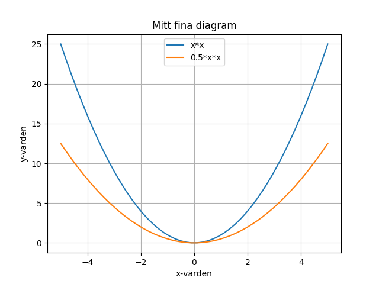
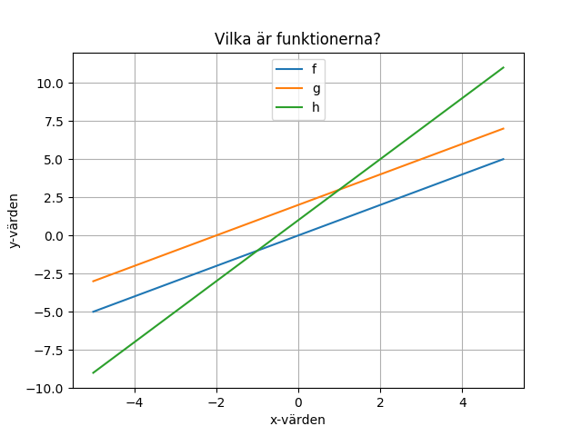

I denna uppgift kommer vi att experimentera med funktioner genom att plotta dem. Vi kommer att använda ett av Pythons bibliotek, `matplotlib.pyplot` som kan användas för att plotta mätvärden.

Koden i denna uppgift är provkörd på [http://repl.it/languages/python3](http://repl.it/languages/python3) (Python 3).

### 1. Plotta en enkel funktion

För att plotta en funktion med matplotlib skickar man in en lista med x-värden och en med motsvarande y-värden, som i följande exempel:

```python
import matplotlib.pyplot as plt
plt.ion()

xs = [-3, -2, -1, 0, 1, 2, 3] # The x values
ys = [-6, -4, -2, 0, 2, 4, 6] # The y values
plt.plot(xs, ys)
plt.savefig('plot.png')
```
Funktionen `plot` sparar plotten på ett internt format inuti biblioteket. Funktionen `savefig` räknar ut en representation av plotten i `png`-format, och sparar i en fil. Anropet `plt.ion()` sätter på "interactive" mode så att plotten även syns i ett fönster.

**Uppdrag:** Läs programmet och försök förstå vad som händer.  Provkör programmet. Bland filerna till vänster ska det nu, förutom `main.py`, även finnas en fil `plot.png` med en funktionsgraf. Klicka på `plot.png`. Du ska kunna se den plottade funktionen.

*Kommentar:* En bugg i repl.it gör att `plot.png` kanske inte dyker upp. Om detta händer, lägg till en dummy-fil genom att trycka på den lilla "Add file"-ikonen ovanför fil-listan () och skriva in valfritt namn. Detta gör att man kommer runt buggen. Kör sedan programmet igen. Nu bör `plot.png` dyka upp i fil-listan. Dummy-filen kan du sedan ta bort om du vill.

**Quiz:** Vilken funktion illustreras av programmet?
<details>
<summary markdown="span">
Svar
</summary>
<p><code>f(x) = 2*x</code>
</p>
</details>

**Uppdrag:** Ändra y-värdena så att programmet i stället illustrerar funktionen `f(x) = 3*x`

<details>
<summary markdown="span">
Lösning
</summary>
<p><code>ys = [-9, -6, -3, 0, 3, 6, 9]</code></p>
</details>


Programmet plottar genom att dra raka streck emellan punkterna. Vad händer om funktionen inte är en rät linje?

**Uppdrag:** Ändra y-värdena så att programmet illustrerar en funktion som inte är en rät linje.

<details>
<summary markdown="span">
Tips
</summary>
<p>Prova t.ex. att sätta y-värdena till kvadraten av x-värdena: <code>ys = [9, 4, 1, 0, 1, 4, 9]</code>.</p>
</details>

### 2. Plotta en funktion som en jämn kurva

Som du kanske såg så blev kurvan kantig i förra uppdraget. För att få en jämn kurva så kan vi skapa en x-lista med många värden, och med korta avstånd mellan värdena, t.ex. `[-3.0, -2.9, -2.8, ..., 2.8, 2.9, 3.0]`. Vi måste då också skapa en lika lång lista med motsvarande y-värden.

Följande hjälpfunktion `fplot` plottar en funktion `f` mellan x-värdena `a` och `b` med hjälp av 1000 punkter:
```python
# plotta funktionen f för a <= x <= b
def fplot(f, a, b):
  N = 1000             # Antalet punkter att plotta
  dx = (b - a) / (N-1) # Avståndet mellan punkterna
  xs = [a + i*dx for i in range(N)]    # Räkna ut x-värdena
  ys = [f(a + i*dx) for i in range(N)] # Räkna ut y-värdena
  plt.plot(xs, ys)     # Plotta funktionen f
```

**Uppdrag:** Försök förstå koden i `fplot`. Funktionen använder en konstruktion som kallas *listomfattning* (*list comprehension* på engelska).
<details>
<summary markdown="span">
Hur listomfattning fungerar
</summary>
<p>En listomfattning använder en särskild slags for-loop för att räkna ut vilka element listan omfattar: uttrycket till vänster om <code>for</code> räknas ut och stoppas in i listan för varje varv i loopen.</p>
<p>Här är ett enklare exempel på listomfattning:
<pre>
L = [i*2 for i in range(3)]
</pre>
För att beräkna denna lista körs for-loopen igenom 3 gånger, där <code>i</code> får de successiva värdena 0, 1, 2. För varje varv räknas <code>i*2</code> ut och stoppas in i listan. Resultatet blir listan [0, 2, 4].
</p>
</details>

**Uppdrag:** Lägg till hjälpfunktionen `fplot` i ditt program. Konstruera en funktion
```python
def g(x):
  return x * x
```
och plotta g-funktionen från -5 till 5.

<details>
<summary markdown="span">
Tips
</summary>
<p>Anropa <code>fplot(g, -5, 5)</code>. Glöm inte att skriva ut den resulterande plotten på fil genom att anropa <code>savefig</code>. </p>
</details>

**Uppdrag:** Hur många punkter behövs för att kurvan ska se jämn ut? Klarar man sig med färre än 1000? Experimentera genom att prova med olika värden på `N` i `fplot`.

### 3. Plotta en funktion till

Vi kan plotta flera funktioner i samma diagram. Det är bara att anropa `fplot` en gång för varje funktion.

**Uppdrag:** Hur skiljer sig funktionen `g(x) = x * x` från funktionen `h(x) = 0.5 * x * x`? Definiera en ny funktion `h` och plotta både `g` och `h`.

<details>
<summary markdown="span">
Svar
</summary>
<p>
<pre>
def h(x):
  return 0.5 * x * x
</pre>
Kan du se att <code>h</code> är hälften så hög som <code>g</code> överallt?
</p>
</details>


### 4. Sätt etiketter på axlarna

Vi borde skriva ut etiketter på axlarna. Här visas ett exempel som också skriver ut en titel på plotten och visar hjälplinjer.

```python
xs = [1,2,3]
ys = [2,4,7]
plt.plot(xs, ys)
plt.title("Mitt fina diagram")   # Sätt titel på diagrammet
plt.xlabel("x-värden")           # Sätt etikett på x-axeln
plt.ylabel("y-värden")           # Sätt etikett på y-axeln
plt.grid(True)                   # Visa hjälplinjer
plt.savefig("plot.png")
```

**Uppdrag:** Ändra ditt program så att du lägger till etiketter på axlarna, hjälplinjer och titel på plotten.

### 5. Skriv ut en legend för funktionerna

När man plottar flera funktioner samtidigt vill man gärna ha en *legend* som visar vilken funktion som är vilken. Detta kan man göra genom att se till att `plt.plot` anropas med ett extra argument på följande sätt:

```python
plt.plot(xs, ys, label="min funktion")
```
Här är `label` namnet på en valfri parameter till plot. (Eftersom parametern är valfri måste vi ange dess namn när vi använder den.)

Förutom att anropa `plt.plot` med den extra parametern behöver vi också göra ett anrop

```python
plt.legend(loc = "upper center")
```
för att legenden skall skrivas ut. Den valfria parametern `loc` anger var i diagrammet legenden skall skrivas ut.

Här är ett exempel där vi lagt till en legend till diagrammet.



**Uppdrag:** Ändra ditt program så att en legend skrivs ut enligt exemplet ovan. *Tips:* Du behöver lägga till en extra parameter till `fplot`.

<details>
<summary markdown="span">
Mer tips
</summary>
<p>
Lägg till en fjärde parameter <code>l</code> i definitionen av <code>fplot</code>. Använd <code>l</code> vid anropet av <code>plt.plot</code>. Ändra anropen till <code>fplot</code> så att du lägger till en fjärde parameter, nämligen strängen du vill skriva ut för kurvan.
</p>
</details>

<details>
<summary markdown="span">
Lösning
</summary>
<p>
<pre>
import matplotlib.pyplot as plt
plt.ion()

def fplot(f, a, b, l):
  N = 50
  dx = (b - a) / (N-1)
  xs = [a + i*dx for i in range(N)]
  ys = [f(a + i*dx) for i in range(N)]
  plt.plot(xs, ys, label=l)

def g(x):
  return x * x

def h(x):
  return 0.5 * x * x

fplot(g, -2, 2, "x*x")
fplot(h, -2, 2, "0.5*x*x")
plt.title("Mitt fina diagram")
plt.xlabel("x-värden")
plt.ylabel("y-värden")
plt.legend(loc = "upper center")
plt.grid(True)
plt.savefig("plot.png")
</pre>
</p>
</details>


### 6. Använd anonyma funktioner (lambdas)

Python-funktionerna `g(x)` och `h(x)` har definierats bara för att du skall kunna skicka med dem som parameter till `fplot`. Det finns ett enklare sätt: Du kan skriva funktionen direkt i anropet till `fplot` med hjälp av en så kallad *lambda*. En lambda är en anonym funktion, alltså bara själva funktionsdefinitionen, utan något namn.

I stället för att skriva:

```python
def f(x):
  return x*x

fplot(f, -5, 5, "x*x")
```

så kan du skriva

```python
fplot(lambda x: x*x, -5, 5, "x*x")
```

**Uppdrag:** Refaktorisera ditt program så att du använder lambdas istället för `g` och `h`.

### 7. Vilken är funktionen?

Här visas tre funktioner. Vilka är de?



**Uppdrag:** Ändra ditt program så att de tre funktionerna ovan ritas ut.

<details>
<summary markdown="span">
Tips
</summary>
<p>
Alla funktionerna är första gradens polynom (räta linjer), så de bör ha formen <code>k*x + m</code>. Frågan är vilka konstanterna <code>k</code> och <code>m</code> är?
</p>
</details>

### 8. Andragradspolynom

Ett andragradspolynom har formen `a2*x*x + a1*x + a0`, där `a2`, `a1` och `a0` är konstanter.

**Uppdrag:** Plotta polynomen `x*x`, `2*x` och deras summa `x*x + 2*x`. Gör plotten från `-2` till `2`. Kan du se att det tredje polynomet är en summa av de två första?

**Uppdrag:** Vad händer om du lägger till konstanten `5`?

*Tips*: Plotta alla tre termerna var för sig (`x*x`, `2*x` och `5`), och dessutom hela summan.

### 9. Utmana dina kompisar (eller din mattelärare :-)

**Uppdrag:** Plotta egna funktioner. Kan dina kompisar lista ut vilka de är? (Hade du själv kunnat lista ut det?)

*Tips:* Prova med olika polynom, eller importera biblioteket `math` för att använda trigonometriska funktioner, exponential-funktionen, etc. Se [https://docs.python.org/3/library/math.html](https://docs.python.org/3/library/math.html).

Om du adderar eller multiplicerar olika funktioner med varandra kan det bli väldigt klurigt att lista ut vilka de är. Men du kanske inte skall göra problemen alltför kluriga...

Om du vill veta mer om plot-möjligheterna i `matplotlib.pyplot`, se t.ex. [denna tutorial](https://matplotlib.org/tutorials/introductory/pyplot.html).
