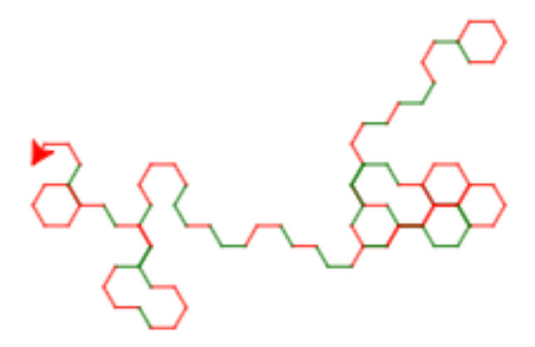

# Slumpvandring


I denna uppgift får du träna på if-satser och block-struktur i program.

Koden i denna uppgift är provkörd på [http://replit.com/languages/python-turtle](http://replit.com/languages/python-turtle) (Python 2.7).

### 1. Alternativa färger

I följande program ritas antingen ett rött eller grönt streck, beroende på värdet på `r`.

```python
import turtle
t = turtle.Turtle()

r = 1               # r får värdet 1
if r==1:            # testa om r har värdet 1
  t.color("red")    #  i så fall, sätt färgen till röd
else:               # i annat fall
  t.color("green")  #  sätt färgen till grön
t.forward(50)       # gå sedan framåt
```

**Uppdrag:** Prova programmet. Vilken färg ritas? Prova att ändra `r = 1` till `r = 2`. Vilken färg ritas nu? Hur fungerar if-satsen?

(Om du har svårt att se skillnad på färgerna, ändra dem till andra färger.)

### 2. Slumpfärger

I stället för att sätta värdet på `r` till `1` eller `2` kan du använda ett slumptal:

```python
from random import randint
r = randint(1,2)
```

Uttrycket `randint(1,2)` ger värdet `1` eller `2` med samma sannolikhet (50%).

**Uppdrag:** Ändra programmet så att värdet på `r` sätts genom att dra ett slumptal. Kör programmet några gånger. Får du fram olika färger?

<details>
<summary markdown="span">
Lösning
</summary>
<pre>
import turtle
t = turtle.Turtle()

from random import randint
r = randint(1,2)

if r==1:
  t.color("red")
else:
  t.color("green")
t.forward(50)
</pre>
</details>


### 3. Slumpsväng

Nu vill vi att paddan skall svänga till vänster när färgen sätts till röd, och till höger när färgen sätts till grön.

**Uppdrag:** Lägg till kod inuti if-satsen så att paddan svänger till vänster respektive höger förutom att sätta färgen. Kör programmet några gånger. Får du paddan att göra rätt?

(Du kan själv bestämma hur många grader paddan skall svänga.)

<details>
<summary markdown="span">
Lösning
</summary>
<pre>
import turtle
t = turtle.Turtle()

from random import randint
r = randint(1,2)

if r==1:
  t.color("red")
  t.left(45)
else:
  t.color("green")
  t.right(45)
t.forward(50)
</pre>
</details>


### 4. Slumpvandring

Nu skall vi utöka programmet med en funktion `randomwalk` som tar ett antal steg och slumpmässigt svänger vänster med röd färg eller höger med grön färg.

I funktionen definierar vi ett antal parametrar så vi enkelt kan välja hur många steg paddan skall ta (`steps`), hur många grader den skall svänga (`angle`) och hur långa stegen skall vara (`steplength`). Vi provar att anropa den med 30 steg, vinkel 100, och steglängd 20:

```python
import turtle
t = turtle.Turtle()
t.speed(10)

from random import randint

def randomwalk(steps, angle, steplength):
  for c in range(steps):
    r = randint(1,2)
    # lägg till en if-sats här för att svänga och byta färg
    # beroende på värdet på r
    t.forward(steplength)

randomwalk(30,100,20)
```
Men funktionen är inte riktigt klar än.

**Uppdrag:** Lägg till en if-sats så att funktionen för varje steg svänger slumpmässigt till vänster med röd färg eller till höger med grön färg. Prova programmet med olika parametrar.

*Tips!* När du nästlar funktionsdefinitioner (`def`), loopar (`for`) och if-satser (`if`) inuti varandra får du en *block-struktur* där de inre delarna av varje konstruktion skall vara indragna ett antal blanksteg, som i följande exempel:

```python
a = 1     # Kommando på yttersta nivån

def p():  # funktionen p är definierad på yttersta nivån
  b = 2               # Kommando inuti p-definitionen
  for i in range(5):  # For-loop inuti p-definitionen
    c = 3             #   Kommando inuti for-loopen
    d = 4             #   Kommando inuti for-loopen
    if c==d:          #   if-sats inuti for-loopen
      e = 5           #     Kommando inuti if-satsens "then"-gren
      f = 6           #     Kommando inuti if-satsens "then"-gren
    else:             #   "else" skall ha samma indragning som "if"
      g = 7           #     Kommando inuti if-satsens "else"-gren
    h = 8             #   Kommando inuti for-loopen
  j = 9               # Kommando inuti p-definitionen
  k = 10              # Kommando inuti p-definitionen

p()       # Kommando på yttersta nivån (anrop av p)
```

Observera att `if` och `else` skall vara indragna lika mycket för att Python skall förstå att de hänger ihop. Delen direkt efter `if` kallas "then"-grenen. Delen direkt efter `else` kallas "else-grenen".

<details>
<summary markdown="span">
Lösning
</summary>
<p>Programmet bör se ut så här:</p>
<pre>
import turtle
t = turtle.Turtle()
t.speed(10)

from random import randint

def randomwalk(steps, angle, steplength):
 for i in range(steps):
   r = randint(1,2)
   if r == 1:
     t.color("red")
     t.left(angle)
   else:
     t.color("green")
     t.right(angle)
   t.forward(steplength)

randomwalk(30,100,20)
</pre>
</details>
