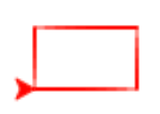
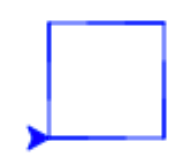
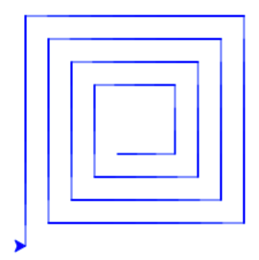
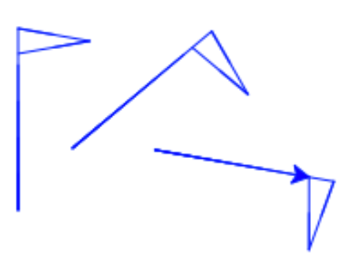
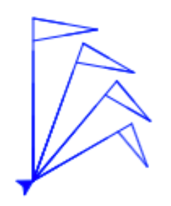
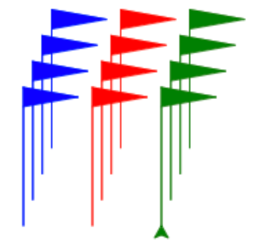

Vill du rita snygga & coola saker med en programmerbar sköldpadda? Då är detta uppdraget för dig!

### 1. Komma igång

Börja med att öppna två fönster, sida vid sida. Ett för detta uppdrag, och ett för [Python-turtle](https://repl.it/languages/python_turtle)

*Tips!* För att få fönstren sida vid sida kan du 1) göra detta fönster smalare, som halva skärmbredden, 2) öppna python-turtle i en ny flik, 3) dra fliken till sidan, så blir den ett nytt fönster.

<iframe width="560" height="315" src="https://www.youtube.com/embed/EQ_qSMKEWJI?rel=0" frameborder="0" allow="autoplay; encrypted-media" allowfullscreen></iframe>

**Uppdrag:** Titta igenom videon (1 minut, inget ljud).

### 2. Rektangel
<!--Sekvens-->

Vi börjar med att låta paddan göra några saker i *sekvens*. Här är ett enkelt exempel där paddan går en liten tur:

```python
import turtle

t = turtle.Turtle()
t.color("red")

t.forward(75)
t.left(90)
t.forward(100)
t.right(90)
```

Kör programmet och se vad som händer. Kan du lista ut vad varje rad gör? Prova att ändra ett värde och se hur beteendet förändras. Prova tills du förstår vad `forward`, `left` och `right` gör.

**Uppdrag:** Kan du få paddan att rita en rektangel?



*Tips!* Om du tycker paddan ritar för långsamt, lägg till ett anrop `t.speed(10)` för att rita snabbare.


### 3. Kvadrat
<!-- Repetition -->

Ibland vill vi låta paddan *repetera* en sekvens av saker. Här är ett enkelt exempel där sköldpaddan repeterar en liten sekvens med hjälp av en *for-loop*.

```python
import turtle

t = turtle.Turtle()
t.color("blue")

for c in range(3):
  t.forward(25)
  t.left(90)
  t.forward(20)
  t.right(90)
```
Prova programmet och se vad som händer. Prova att ändra olika saker i programmet. Kan du få paddan att repetera fler gånger? Kan du rita en annan slags figur genom att ändra innehållet i for-loopen?

*Obs!* Som du ser är innehållet i loopen *indraget* några blanksteg. Detta är Pythons sätt att hålla reda på vad som ingår i loopen. Du kan använda hur många blanksteg du vill, det viktiga är att det är lika många blanksteg för varje sats i loopen. Här har vi använt 2 blanksteg.

**Uppdrag:** Kan du rita en kvadrat på ett smart sätt med hjälp av en for-loop?




<details>
  <summary markdown="span">
    Tips
  </summary>
  <pre>
for c in range(4):
  t.forward(75)
  t.left(90)
  </pre>
</details>


### 4. Spiral
<!-- Loop variabel -->

Variabeln `c` i for-loopen är ett heltal som ändrar värde för varje varv i loopen. Prova att se vad värdet på loop-variabeln är genom att lägga till

```python
t.write(c)
```
inuti loopen.

**Uppdrag:** Kan du rita en fyrkantig spiral på ett smart sätt genom att använda `c` för att låta paddan gå lite längre efter varje sväng?




<details>
  <summary markdown="span">
    Tips
  </summary>
  <pre>
for c in range(16):
  t.forward(75+10*c)
  t.left(90)
  </pre>
</details>


### 5. Figur
<!-- funktion -->

Genom att definiera en *funktion* kan du göra egna byggblock som du kan använda på flera ställen.

Här definierar vi en funktion som ritar en liten vimpel, och gör sedan ett anrop av funktionen:

```python
import turtle
t = turtle.Turtle()
t.color("blue")

def vimpel() :   # Definition av vimpel
  t.forward(100)
  t.right(100)
  t.forward(40)
  t.right(160)
  t.forward(40)
  t.right(100)

vimpel()         # Anrop av vimpeln
```

*Obs!* Som du ser är innehållet i definitionen *indraget* några blanksteg, så att Python skall veta vilka satser som ingår i definitionen. Anropet ingår inte i definitionen, utan ligger ute i vänsterkanten. Blankrader betyder ingenting, utan är bara till för att programmet skall bli lättare att läsa.

Vi kan prova att rita ut vimpeln på flera ställen. För att hoppa till olika ställen får vi be paddan dra upp sin penna.

```python
t.setheading(90)
vimpel()
t.right(120)
t.penup()
t.forward(70)
t.pendown()
t.left(120)
vimpel()
```


**Uppdrag:** Kan du lägga till en funktion `figur` som ritar en enkel figur? T.ex. bokstaven L, eller något du hittar på själv. Prova att rita ut den på flera ställen.




*Tips!* Om du har flera funktioner kan du lägga dem efter varann, och anropen till funktionerna sist i programmet, i följande stil:

```python
def f1():
  # innehåll i f1

def f2():
  # innehåll i f2

f1() # anrop av f1
f2() # anrop av f2
```


### 6. Hoppa
<!-- funktion med parameter -->

Genom att ge en funktion parametrar blir den mer användbar.

För att slippa lyfta och sänka pennan kan vi definiera följande funktion `hop` som tar en parameter `length` för att hoppa en viss längd:

```python
def hop(length) :
  t.penup()
  t.forward(length)
  t.pendown()
```

**Uppdrag:** Lägg till funktionen `hop` ovan. Prova att ersätta din kod som lyfte och sänkte pennan med att anropa `hop`, t.ex:

```python
t.setheading(90)
figur()
t.right(120)
hop(70)
t.left(120)
figur()
```

### 7. Skalbar figur
<!-- funktion med parameter -->

**Uppdrag:** Ändra din funktion `figur` så den tar en parameter `h` som representerar höjden på figuren. Rita alla delar skalenligt. Låt `100` motsvara att figuren ritas ut i skala 1:1. Anropa din funktion med olika värden på `h`.


<details>
  <summary markdown="span">
    Tips
  </summary>
Multiplicera sträckor med <code>h</code> och dividera med 100. Dvs i stället för att skriva <code>forward(60)</code>, skriv <code>forward(60*h/100.0)</code>.
</details>

### 8. Neutral figur
<!-- funktion med flera parametrar -->

Lägg till nedanstående funktion `jumpTo` som flyttar paddan till läget `(x,y)`, utan att rita:

```python
def jumpTo(x, y) :
  t.penup()
  t.setpos(x,y)
  t.pendown()
```

Prova att anropa `jumpTo` i stället för `hop` för att rita figuren på flera ställen.

Det kan vara praktiskt att en ritfunktion är både *rotations-* och *positionsneutral*, dvs att sköldpaddans position och riktning är oförändrad efter ett anrop till funktionen.
Detta kan du åstadkomma genom att spara positionen och riktningen innan du ritar, och återställa dem efteråt:

```python
x = t.xcor()    // spara x-koordinaten i variabeln x
y = t.ycor()    // spara y-koordinaten i variabeln y
v = t.heading() // spara vinkeln i variabeln v
# rita ...
jumpTo(x,y)     // hoppa tillbaka
t.setheading(v) // återställ riktningen
```

**Uppdrag:** Ändra din funktion `figur` så den blir rotations- och positionsneutral.

Prova att du lyckades genom att omväxlande anropa `figur` och `right`.




### 9. Dekor
<!-- Flera funktioner och anrop -->

**Uppdrag:** Skriv en funktion `dekor` som anropar `figur` några gånger för att få ett intressant mönster. Prova med olika vinklar och olika storlekar. Prova att flytta paddan på olika sätt mellan anropen till `figur`. Du kan använda loopar och extra funktioner om du vill.



*Tips!* Figuren ovan har ritats med `fill` påslaget:

```python
t.fill(True)
# rita ...
t.fill(False)
```


<!--

# Alternativ

TODO - någon övning på if-satser


# Tårta

TODO - en övning för att göra en funktion som ritar en tårta som har en färg för kanten och en för innehållet, och som kan placeras i antingen x eller y-led (så man kan rita flera tårtor bredvid varandra). Att användas i Piece-of-cake-uppdraget.

# Rita en blomma

TODO - en övning för att göra en funktion som ritar en liten enkel blomma. Ge funktionen x o y-parametrar så man kan dekorera tårtan genom att rita blommor på den. Att användas i Piece-of-cake-uppdraget.

# Rita koordinataxlar

TODO - övning för att göra en funktion som ritar en x och en y-axel. Att användas senare i uppdrag om att rita matematiska funktioner.

# Färgglad sköldpadda

Kör följande i varje steg i loopen (glöm inte att lägga till `import random` längst upp i filen!)

```py
t.color(random.choice(['red', 'green', 'magenta', 'orange', 'blue']))
```

-->
