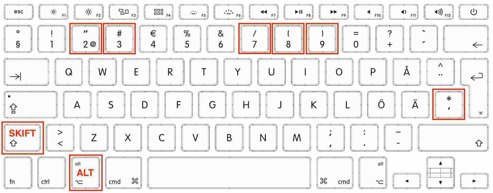
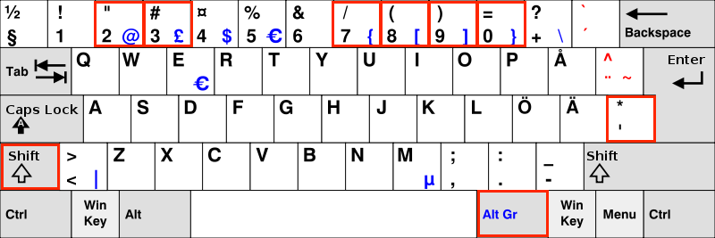

| Tecken  | Svenska  | Engelska  | Används i Python |
|:-------:|:----:|:--------:|
|`#`      |brädgård|hash|inleder kommentar
|`*`      |asterisk|asterisk|multiplikation
| `/`     |snedstreck|slash|division
|`"..."`      |dubbelfnutt|double quote|runt strängar
| `'...'`     |enkelfnutt|single quote|runt strängar
|`[...]`      |hakparenteser, vänster/höger hake|square brackets|runt listor
| `{...}`     |krullparenteser, måsvingar, vänster/höger krulle|curly brackets, braces, curly braces|runt mängder

## Mac-tangentbord

För att få fram tecknen behöver du känna till
* SKIFT-tangenten - den man får stora bokstäver med
* ALT-tangenten - sitter nere till vänster. Kallas också *option*.

Genom att hålla nere en eller båda av dessa tangenter innan du trycker på en annan tangent kan du få fram ovanliga tecken.

| Tecken  | Håll nere  | Tryck på  |
|:-------:|:----:|:--------:|
|`#`      |SKIFT|3|
|`*`      |SKIFT|*|
|`/`      |SKIFT|7|
|`"`      |SKIFT|2|
| `'`     |*ingen*|*|
|`[`      |ALT|8|
| `]`     |ALT|9|
| `{`     |ALT+SKIFT|8|
| `}`     |ALT+SKIFT|9|

## Windows-tangentbord

För att få fram tecknen behöver du känna till
* SKIFT-tangenten - den man får stora bokstäver med
* ALT GR-tangenten - sitter nere till höger. Ibland är den bara märkt med ALT.

Genom att hålla nere en av dessa tangenter innan du trycker på en annan tangent kan du få fram ovanliga tecken.

| Tecken  | Håll nere  | Tryck på  |
|:-------:|:----:|:--------:|
|`#`      |SKIFT|3|
|`*`      |SKIFT|*|
|`/`      |SKIFT|7|
|`"`      |SKIFT|2|
| `'`     |*ingen*|*|
|`[`      |ALT GR|8|
| `]`     |ALT GR|9|
| `{`     |ALT GR|7|
| `}`     |ALT GR|0|
